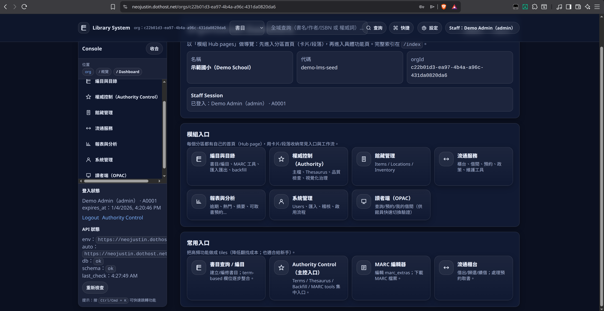

# K–12 Cloud Library System (Lean School Library LMS)

[繁體中文](README.md) | **English**



This project builds a lean, cloud-ready Library Management System (LMS) for K–12 schools in Taiwan, optimized for **limited staffing** and **tight budgets**—while keeping cataloging/search/circulation correct and extensible.

This repository contains:
- **Domain references** (A–J: cataloging, classification, subject analysis, metadata, IR, collection management, circulation, users, information behavior, ethics/policy)
- **MVP deliverables you can implement** (user stories, API draft, data dictionary, DB schema)
- **A runnable MVP+ system** (TypeScript monorepo: NestJS API + Next.js Web + shared SSOT)

> If you’re new to TypeScript/Next.js/NestJS, start with `docs/README.md`.

## Current Status
- Docs are “implementation-ready”: `MVP-SPEC.md`, `USER-STORIES.md`, `API-DRAFT.md`, `DATA-DICTIONARY.md`, `db/schema.sql`
- End-to-end MVP+ is runnable: `apps/api` implements cataloging (CSV + MARC import), authority control (terms + thesaurus), advanced search (field selection + AND/OR/NOT), circulation/holds, inventory, reports, audit, and `/health`; `apps/web` ships a Staff Console (`/orgs`) and OPAC (`/opac`, including `/me`)
- Architecture decisions and trade-offs are documented: `ARCHITECTURE.md`, `docs/design-rationale.md`

## MVP+ Scope (What You Can Do Today)
The MVP+ focuses on making core school workflows reliable, while also covering the “day-1 cataloging/search” pain points:
- CSV roster import: students/teachers, class grouping, deactivation (graduation/leave)
- Bibliographic records + item copies: multiple copies, barcode, call number, location, status
- MARC21: shared field dictionary (SSOT), MARC editor validation, MARC import (preview/apply)
- Authority control: `authority_terms` + thesaurus relations (BT/RT/variants), including a visual editor
- Search: fuzzy queries (name/title/barcode/call number/location), OPAC advanced search (field selection + AND/OR/NOT) + metadata filters
- Circulation: checkout, check-in, renewals, holds, ready holds, expire-ready maintenance (sync or background job)
- Inventory sessions: scanning workbench + diff lists + CSV exports
- Reports (CSV/print): top circulation, overdue, ready holds, zero circulation
- Audit trail: `audit_events` for checkout/check-in/import/status changes
- OPAC account: patron login + `/me` (my loans / my holds)

Default MVP policies are defined in `MVP-SPEC.md`.

## Tech Stack & Extensibility
We use a **Modular Monolith** approach: low ops overhead for MVP, with clear boundaries so it can evolve into multiple services later if needed.

- Language: TypeScript (shared types across web+api)
- Backend: NestJS (modules, DI, testability)
- Frontend: Next.js (admin UI + OPAC; PWA-friendly)
- Database: PostgreSQL (transactions + JSONB; trigram search; multi-tenant RLS; migrations for production)
- Shared: `packages/shared` (SSOT for MARC21 field dictionary + authority linking rules)

See `ARCHITECTURE.md` and `docs/design-rationale.md` for the reasoning and alternatives.

## Repository Structure
```
.
├─ apps/
│  ├─ api/          # NestJS API (/api/v1)
│  └─ web/          # Next.js Web (Staff Console: /orgs, OPAC: /opac)
├─ packages/
│  └─ shared/       # SSOT: MARC21 field dictionary, authority linking rules
├─ db/
│  ├─ schema.sql       # Demo/dev: readable, idempotent
│  ├─ migrations/      # Production: traceable migrations (schema_migrations)
│  ├─ seed-demo.sql    # Demo seed (idempotent)
│  └─ README.md     # DB notes
├─ reference-docs/  # A–J references/drafts
└─ docs/            # How it works, primer, design rationale
```

## Key Docs (Start Here)
- Entry point for newcomers: `docs/README.md`
- How the system works end-to-end: `docs/how-it-works.md`
- TypeScript/Next/Nest primer: `docs/typescript-nextjs-nestjs-primer.md`
- Design trade-offs & roadmap: `docs/design-rationale.md`
- “Source of truth” for implementation: `MVP-SPEC.md`, `USER-STORIES.md`, `API-DRAFT.md`, `DATA-DICTIONARY.md`, `db/schema.sql`
- MARC21 SSOT + “quick-create” authority terms: `docs/implementation/0043-marc21-ssot-and-authority-quick-create.md`
- Advanced search + blue UI refresh: `docs/implementation/0044-advanced-search-and-ui-blue-theme.md`
- Playwright E2E: `docs/testing/playwright-e2e.md`
- SSH + Docker Compose deployment: `docs/deployment/ssh-docker-compose.md`

## Local Development (from zero to running)
Prerequisites:
- Node.js 20+ and npm
- Docker Desktop (PostgreSQL/Redis)

### 1) Start the database
```bash
docker compose up -d postgres redis
```

### 2) Install dependencies
```bash
npm install
```

### 3) Apply the DB schema (draft)
PowerShell example:
```powershell
Get-Content db\\schema.sql | docker compose exec -T postgres psql -U library -d library_system
```

### 4) Run dev servers (web + api)
```bash
npm run dev
```

Check:
- Web: `http://localhost:3000`
- API: `http://localhost:3001/health`

## Run the Full Stack in Docker (DB + API + Web + demo seed + smoke)
If you want both frontend and backend to run inside Docker (closer to a deployable setup):

### 1) Bring up the stack (build images)
```bash
npm run docker:up
```

If you hit port conflicts (common ones: `6379`/`5432`/`3000`/`3001`), override host ports via env vars:
```bash
REDIS_PORT=6380 POSTGRES_PORT=55432 API_HOST_PORT=3002 WEB_HOST_PORT=3003 npm run docker:up
```

### 2) Load demo seed data (idempotent)
```bash
npm run docker:seed
```

### 2.5) (Optional) Load a large dataset (Scale seed)
This creates/rebuilds an additional org (default `demo-lms-scale`) with lots of users/bibs/items/loans/holds/inventory/audit events, so you can validate list/search/report UI under “realistic” volume.

```bash
npm run docker:seed:scale
```

All-in-one (up + scale seed):
```bash
npm run docker:scale
```

Demo accounts (shared password `demo1234`):
- Staff: admin `A0001` / librarian `L0001`
- OPAC: teacher `T0001` / student `S1130123`

> Security note: demo passwords are for local/dev only. If you expose the site (staging/prod), change passwords and set a strong `AUTH_TOKEN_SECRET`.

### 3) Run smoke tests (inside Docker network)
```bash
npm run docker:smoke
```

All-in-one (wipe DB volume → up → seed → smoke):
```bash
npm run docker:test
```

Shut down:
```bash
npm run docker:down
```

Remove volumes too (deletes DB data):
```bash
npm run docker:down:volumes
```

## Automated Testing (Playwright)
- One-command QA (build/up + scale seed + Playwright + summary): `npm run qa:e2e`
- Run Playwright only: `npm run e2e`
- Open HTML report: `npm run e2e:report`

## Production DB Migrations
For production (staging/prod), use `db/migrations/*` + `schema_migrations` (instead of directly applying `db/schema.sql`).

Run:
```bash
npm run db:migrate
```

## Deployment (SSH + Docker Compose)
- Guide: `docs/deployment/ssh-docker-compose.md`
- Reverse proxy recommendation: route `/` to Web (3000), and route `/api/v1/*` + `/health` to API (3001)

## Turning Docs into Code (Recommended Workflow)
1. Pick a story in `USER-STORIES.md` (e.g., US-040 checkout).
2. Align request/response/errors in `API-DRAFT.md`.
3. Verify fields and constraints in `DATA-DICTIONARY.md` and `db/schema.sql`.
4. Implement API (Controller → Service → DB transaction), then implement Web UI.
5. Update `docs/` to document decisions and trade-offs.

## Contributing
- Follow `AGENTS.md` (doc conventions, naming, commands, and “keep docs in sync” rule).
- Some `reference-docs/` exports may contain personal data (e.g., `**User:**` lines). Redact before making the repository public.
