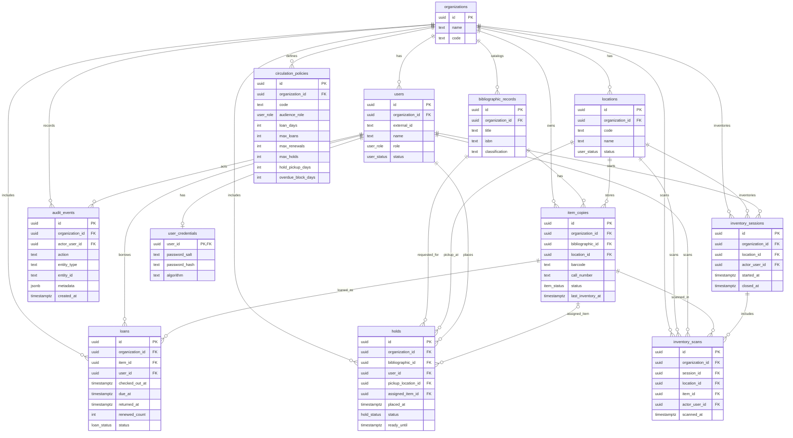

# ER Diagram（依目前資料庫設計）

本文件依 `db/schema.sql` 產出 ER（Entity–Relationship）圖，用來把「資料模型」視覺化，讓你在討論功能流程（借還、預約、匯入、報表）時能快速對齊：
- 哪些是核心實體（entity）
- 彼此怎麼關聯（foreign keys / cardinality）
- 哪些一致性由資料庫 constraint 保證（例如條碼唯一、同冊同時只能有一筆未歸還借閱）

> 這張 ER 圖是 **MVP 版**：先把最難補救的資料結構定好，再逐步加欄位/加表。

## 1) 模型核心觀念（你要先記住的 3 件事）
1. **多租戶（Multi-tenant）**：所有核心資料表都帶 `organization_id`，代表「這筆資料屬於哪一所學校」。  
   這讓系統未來可以服務多校，而不用大改資料庫。
2. **書目 vs 冊分離**：  
   - `bibliographic_records`（書目）描述「一本書是什麼」  
   - `item_copies`（冊）描述「這一冊在哪裡、能不能借」  
   借還永遠作用在「冊」。
3. **借還是交易（transaction）**：借出/歸還會同時改多張表（loan、item status、audit、可能還有 hold），所以 API 設計採「動作端點」集中處理。

## 2) Cardinality（基數）入門：1 對 1 / 1 對多 / 多對多
Cardinality（基數）用來描述「一筆 A 對應到幾筆 B」以及反向「一筆 B 對應到幾筆 A」。

在關聯式資料庫（RDBMS）裡，基數通常由 **外鍵（FK）放在哪裡**、以及 **是否允許 NULL / 是否 UNIQUE** 共同決定：
- **多對一（N:1 / Many-to-One）**：表 B 有 FK 指向表 A ⇒ 很多筆 B 會指向同一筆 A。  
  - 若 FK 欄位 **NOT NULL**：每筆 B 都必須指向「剛好一筆 A」（1）。  
  - 若 FK 欄位 **可為 NULL**：每筆 B 可能指向「零或一筆 A」（0..1）。
- **一對多（1:N / One-to-Many）**：是多對一的反向描述。  
  同一筆 A 可被多筆 B 指向（0..N 或 1..N，取決於是否允許「沒有任何 B」的情境）。
- **一對一（1:1 / One-to-One）**：常見做法是「B 以 FK 指向 A，並對該 FK 加 UNIQUE」。  
  例：`user_credentials.user_id` 是 FK 且 UNIQUE ⇒ 一個 user 最多只有一份 credentials。
- **多對多（M:N / Many-to-Many）**：用「關聯表（junction/association table）」實作。  
  例：`bibliographic_records` ↔ `subjects` 若要正規化，會用 `bibliographic_subjects(bib_id, subject_id)`。

> 補充：**多對一** 與 **一對多** 是同一條關係的兩種觀看方向；差別只是你站在「哪張表」看。

## 3) ER Diagram（Mermaid）
> GitHub 會直接渲染 Mermaid；若你的編輯器沒顯示，可先把下方貼到 Mermaid Live Editor 預覽。

## 4) 關聯總覽（FK + cardinality）
以下以 `db/schema.sql` 的外鍵為準（`NOT NULL` 表示必須存在；可為 NULL 表示可選）。

| 關聯（從語意看） | FK（放在哪一側） | FK 必填？ | 基數（Parent → Child） | 反向（Child → Parent） |
| --- | --- | --- | --- | --- |
| 組織 → 位置 | `locations.organization_id` → `organizations.id` | 是 | `organizations 1 → locations 0..N` | `locations N → organizations 1` |
| 組織 → 使用者 | `users.organization_id` → `organizations.id` | 是 | `organizations 1 → users 0..N` | `users N → organizations 1` |
| 組織 → 書目 | `bibliographic_records.organization_id` → `organizations.id` | 是 | `organizations 1 → bibliographic_records 0..N` | `bibliographic_records N → organizations 1` |
| 組織 → 冊 | `item_copies.organization_id` → `organizations.id` | 是 | `organizations 1 → item_copies 0..N` | `item_copies N → organizations 1` |
| 組織 → 借閱政策 | `circulation_policies.organization_id` → `organizations.id` | 是 | `organizations 1 → circulation_policies 0..N` | `circulation_policies N → organizations 1` |
| 組織 → 借閱 | `loans.organization_id` → `organizations.id` | 是 | `organizations 1 → loans 0..N` | `loans N → organizations 1` |
| 組織 → 預約 | `holds.organization_id` → `organizations.id` | 是 | `organizations 1 → holds 0..N` | `holds N → organizations 1` |
| 組織 → 稽核事件 | `audit_events.organization_id` → `organizations.id` | 是 | `organizations 1 → audit_events 0..N` | `audit_events N → organizations 1` |
| 組織 → 盤點 session | `inventory_sessions.organization_id` → `organizations.id` | 是 | `organizations 1 → inventory_sessions 0..N` | `inventory_sessions N → organizations 1` |
| 組織 → 盤點掃描 | `inventory_scans.organization_id` → `organizations.id` | 是 | `organizations 1 → inventory_scans 0..N` | `inventory_scans N → organizations 1` |
| 書目 → 冊 | `item_copies.bibliographic_id` → `bibliographic_records.id` | 是 | `bibliographic_records 1 → item_copies 0..N` | `item_copies N → bibliographic_records 1` |
| 書目 → 預約（排隊） | `holds.bibliographic_id` → `bibliographic_records.id` | 是 | `bibliographic_records 1 → holds 0..N` | `holds N → bibliographic_records 1` |
| 位置 → 冊 | `item_copies.location_id` → `locations.id` | 是 | `locations 1 → item_copies 0..N` | `item_copies N → locations 1` |
| 取書位置 → 預約 | `holds.pickup_location_id` → `locations.id` | 是 | `locations 1 → holds 0..N` | `holds N → locations 1` |
| 位置 → 盤點 session | `inventory_sessions.location_id` → `locations.id` | 是 | `locations 1 → inventory_sessions 0..N` | `inventory_sessions N → locations 1` |
| 位置 → 盤點掃描 | `inventory_scans.location_id` → `locations.id` | 是 | `locations 1 → inventory_scans 0..N` | `inventory_scans N → locations 1` |
| 使用者 → 借閱 | `loans.user_id` → `users.id` | 是 | `users 1 → loans 0..N` | `loans N → users 1` |
| 冊 → 借閱（歷史） | `loans.item_id` → `item_copies.id` | 是 | `item_copies 1 → loans 0..N` | `loans N → item_copies 1` |
| 使用者 → 預約 | `holds.user_id` → `users.id` | 是 | `users 1 → holds 0..N` | `holds N → users 1` |
| 冊 → 預約（可選指派） | `holds.assigned_item_id` → `item_copies.id` | 否 | `item_copies 1 → holds 0..N`（跨時間） | `holds N → item_copies 0..1` |
| 使用者 → 稽核事件 | `audit_events.actor_user_id` → `users.id` | 是 | `users 1 → audit_events 0..N` | `audit_events N → users 1` |
| 使用者 → 憑證 | `user_credentials.user_id` → `users.id` | 是 | `users 1 → user_credentials 0..1` | `user_credentials 1 → users 1` |
| 使用者 → 盤點 session（actor） | `inventory_sessions.actor_user_id` → `users.id` | 是 | `users 1 → inventory_sessions 0..N` | `inventory_sessions N → users 1` |
| 使用者 → 盤點掃描（actor） | `inventory_scans.actor_user_id` → `users.id` | 是 | `users 1 → inventory_scans 0..N` | `inventory_scans N → users 1` |
| 盤點 session → 掃描 | `inventory_scans.session_id` → `inventory_sessions.id` | 是 | `inventory_sessions 1 → inventory_scans 0..N` | `inventory_scans N → inventory_sessions 1` |
| 冊 → 盤點掃描 | `inventory_scans.item_id` → `item_copies.id` | 是 | `item_copies 1 → inventory_scans 0..N` | `inventory_scans N → item_copies 1` |

## 5) 逐條關聯解釋（為什麼是這個基數）
下面用「業務語意」＋「資料庫如何保證」兩個角度來解釋每條關聯。

### 5.1 組織（organizations）是所有資料的分區邊界（1 → 多）
**為什麼都是 1→多？**  
一個學校（organization）天然會擁有多個位置、多個使用者、多筆書目與冊、多筆借閱/預約與稽核紀錄；而每一筆資料也必須屬於「某一所學校」，才能做到資料隔離與權限控管。

**資料庫如何表達？**
- 在各表加入 `organization_id` 且 `NOT NULL`，表示每筆資料必須屬於某組織（所以 Child → Parent 是 N→1）。
- 多數 `UNIQUE` 都是「以 organization 為範圍」：例如同一校內 `barcode` 唯一，但不同校可重複（`UNIQUE (organization_id, barcode)`）。

### 5.2 書目（bibliographic_records）→ 冊（item_copies）：1→多（同書多冊）
**為什麼不是 1→1？**  
同一本書在學校可能有多冊（班級共讀、熱門書補多本）；如果把條碼/位置放在書目上就會讓書目資料重複、或無法表達多冊。

**資料庫如何表達？**
- `item_copies.bibliographic_id` 是 `NOT NULL` FK：每冊必屬於一筆書目（N→1）。
- 書目端不存冊資訊，避免重複；冊端存條碼/索書號/位置/狀態等「實體層」資訊。

### 5.3 位置（locations）→ 冊（item_copies）：1→多（一本書只在一個地方）
**為什麼是多對一（冊 → 位置）？**  
同一時間一冊只能在一個位置（主館、兒童區、某書架）；但一個位置會存放很多冊。

**資料庫如何表達？**
- `item_copies.location_id` 是 `NOT NULL` FK：每冊必定有一個位置（N→1）。
- 如果未來要做「跨館轉運/館際流通」，可以加一個「轉運中」狀態或加 `transfers` 表，不需要把位置改成多對多。

### 5.4 使用者（users）→ 借閱（loans）：1→多（同一人會借很多次）
**為什麼是 1→多？**  
一個人一學期可能借很多本/很多次；但每一筆借閱紀錄只屬於一位借閱者。

**資料庫如何表達？**
- `loans.user_id` 是 `NOT NULL` FK：每筆 loan 必須指向一位 user（N→1）。

### 5.5 冊（item_copies）→ 借閱（loans）：1→多（跨時間的歷史）
**為什麼不是 1→1？**  
同一冊會被不同人借多次（歷史累積），所以是 1→多。

**那為什麼又說「同一時間只能借給一個人」？**  
這是「基數 + 時間條件」的結果：
- 從歷史看：`item_copies 1 → loans 0..N`
- 從「未歸還」的當下看：`item_copies 1 → open_loan 0..1`

**資料庫如何保證？**
- 在 `loans` 上有 partial unique index：同一 `item_id` 在 `returned_at IS NULL` 時只能有一筆 ⇒ 防止重複借出。

### 5.6 書目（bibliographic_records）→ 預約（holds）：1→多（排隊等「這本書」）
**為什麼預約綁書目而不是綁冊？**  
讀者通常是「想借這本書」而不是「想借第 3 冊」；綁書目可以讓系統在任何一冊可用時自動分配。

**資料庫如何表達？**
- `holds.bibliographic_id` 是 `NOT NULL` FK：每筆 hold 必須指向一本書目（N→1）。
- 用 `placed_at` 作為排隊順序（本質上是「對同一書目的一個隊列」）。

### 5.7 預約（holds）→ 冊（item_copies）：可選（0..1）指派
**為什麼是 0..1？**  
預約在排隊階段（`queued`）通常還不知道會分配到哪一冊，所以 `assigned_item_id` 必須允許為 NULL。當某冊歸還、且需要保留給下一位預約者時，才會指派該冊並進入 `ready`（保留期限）。

**基數怎麼看？**
- 從 hold 看 item：`holds N → item_copies 0..1`（因為 `assigned_item_id` 可為 NULL）
- 從 item 看 holds：`item_copies 1 → holds 0..N`（同一冊跨時間可能被多次指派給不同預約）

**目前沒用 DB 強制、但要在程式維持的規則（重要）**
- 指派的冊應該屬於同一書目（`holds.bibliographic_id` 與 `item_copies.bibliographic_id` 應一致）。  
  這跨表一致性很難用單純 FK 強制，通常用應用層檢查或 DB trigger。
- 同一時間一冊最好只對應一個「active hold」（queued/ready），目前先列為待擴充的 constraint。

### 5.8 取書位置（locations）→ 預約（holds）：1→多
**為什麼是 1→多？**  
同一個取書點（例如主館櫃台）會對應很多筆預約；但每一筆預約必須指定一個取書點，才能在到書時正確保留與通知。

**資料庫如何表達？**
- `holds.pickup_location_id` 是 `NOT NULL` FK：每筆 hold 必須指向一個 location（N→1）。

### 5.9 使用者（users）→ 預約（holds）：1→多
**為什麼是 1→多？**  
一位讀者可以同時預約多本書；但每筆預約只屬於一位預約者。

**資料庫如何表達？**
- `holds.user_id` 是 `NOT NULL` FK：每筆 hold 必須指向一位 user（N→1）。

### 5.10 使用者（users）→ 稽核事件（audit_events）：1→多
**為什麼是 1→多？**  
館員/管理者會執行很多操作（匯入、借還、改狀態），每次操作都應可追溯到操作者。

**資料庫如何表達？**
- `audit_events.actor_user_id` 是 `NOT NULL` FK：每筆 audit event 必須指向一位 user（N→1）。

### 5.11 稽核事件（audit_events）→ 被影響資料（多型 polymorphic）
`audit_events.entity_type/entity_id` 指向「被影響的資料」（例如 item/loan/hold）。  
它不是 FK，因為被影響資料可能來自多張表。

**基數怎麼看？**
- 一筆稽核事件只描述一個被影響資料：`audit_events N → entity 1`
- 但一筆資料可能有很多稽核事件：`entity 1 → audit_events 0..N`

**為什麼先用多型？（取捨）**
- 優點：稽核表保持單一結構、查詢與寫入簡單
- 代價：DB 無法強制 `entity_id` 一定存在；需由應用層保證正確性

### 5.12 一對一（1:1）為什麼在 MVP 幾乎不出現？
MVP 階段我們先把表數量壓低，避免過早拆表造成開發與查詢成本上升。  
1:1 通常會在下列情境出現（未來可加，但不是 MVP 必要）：
- 登入/憑證：`user_credentials` 與 `users`（1:1，且 credentials 欄位更敏感）
- 選配資料：把少用但很大的欄位拆出去，讓常用查詢更輕

### 5.13 借閱政策（circulation_policies）與使用者/借閱的關係（邏輯關聯）
你會注意到 `circulation_policies` 沒有用 FK 直接連到 `users` 或 `loans`，原因是它比較像「規則設定」而不是「交易資料」。

**基數與語意**
- `organizations 1 → circulation_policies 0..N`：同一所學校會有多套政策（學生、教師、也可能依館藏類型分政策）
- `circulation_policies N → organizations 1`：每套政策只屬於一所學校

**那 policy 怎麼影響借閱？**
- 借出（checkout）時，系統會根據 `users.role`（以及未來可能的館藏類型）挑出適用 policy，計算：
  - 借期（`due_at`）
  - 借閱上限/續借上限/預約上限

**為什麼不直接在 `loans` 存 `policy_id`？（取捨）**
- 好處：可以追溯「這筆借閱當時用哪個政策」
- 代價：政策可能會改、被刪、或需要版本化；只存 `policy_id` 仍可能失真

因此在 `MVP-SPEC.md` 裡我建議的方向是：未來在 `loans` 存「政策快照」（例如 JSON），讓舊借閱永遠以當時規則解釋（見本文件第 8 章）。

### 5.14 `ON DELETE`（CASCADE/RESTRICT/SET NULL）也是關聯設計的一部分
外鍵不只表達「關聯」，也表達「被刪掉時怎麼辦」：
- **CASCADE**：刪 Parent 時連 Child 一起刪（危險但乾淨）
- **RESTRICT**：如果還有人引用就不能刪（保守、避免誤刪）
- **SET NULL**：刪 Parent 時把 Child 的 FK 清空（保留 Child 記錄，但解除連結）

本 schema 的選擇邏輯是：
- `organizations` → 其他表多為 **CASCADE**：刪掉一個租戶＝整個學校下線，資料一起移除（實務上很少做，但語意一致）。
- `bibliographic_records`/`users`/`locations` 被 `item_copies`/`loans`/`holds` 引用時多為 **RESTRICT**：  
  因為借閱/稽核屬於「需要可追溯」的資料，不希望因為誤刪主檔導致歷史斷鏈。實務上通常改用 `status` 停用，而不是刪除。
- `holds.assigned_item_id` 用 **SET NULL**：  
  指派冊是「暫時性連結」，如果那一冊被移除/合併/資料修正，我們希望保留預約本身（隊列與紀錄仍在），只解除冊的指派。

## 6) 多對多（M:N）在本系統怎麼處理？（現在 vs 未來）
有些關係在概念上是多對多，但 MVP 為了降低表數先用簡化表示；等你要做權威控制、精準統計或複雜查詢時再正規化。

### 6.1 書目 ↔ 作者/責任者（Creators/Contributors）
**概念上是多對多：**
- 一本書可有多位作者/譯者/繪者
- 同一位作者也會對應到很多本書

**MVP 先怎麼做？**
- 目前用 `creators text[]` / `contributors text[]`（陣列）簡化。

**未來正規化（典型 junction table）**
- `agents(id, name, ...)`
- `bibliographic_agents(bib_id, agent_id, role)`

### 6.2 書目 ↔ 主題詞（Subjects）
**概念上是多對多：**
- 一本書有多個主題詞
- 同一主題詞對應很多本書

**MVP 先怎麼做？**
- 目前用 `subjects text[]`（陣列）簡化。

**未來正規化**
- `subjects(id, label, scheme, ...)`
- `bibliographic_subjects(bib_id, subject_id)`

### 6.3 使用者 ↔ 權限（Permissions）
**概念上可能是多對多：**
- 一個使用者可能同時擁有多種權限（例如館員 + 教師）
- 一個權限也會被很多使用者共享

**MVP 先怎麼做？**
- 目前採 RBAC 的「一人一角色」：`users.role`（夠用、最簡單）

**未來若要更細**
- `roles`、`permissions`、`role_permissions`、`user_roles` 會形成多對多結構

## 7) 與功能流程的對應（你會用在討論/實作）
- **借出（checkout）**（交易）：
  - 新增 `loans`
  - 更新 `item_copies.status=checked_out`
  - 寫 `audit_events`
  - DB 保證：同冊同時只能有一筆未歸還借閱（partial unique index）
- **歸還（checkin）**（交易）：
  - 更新 `loans.returned_at`（關閉 loan）
  - 更新 `item_copies.status`（有預約就 `on_hold`，否則 `available`）
  - 寫 `audit_events`
- **預約（hold）**：
  - 新增 `holds`（`queued`）
  - 歸還/調度時指派 `assigned_item_id` → 進入 `ready` 並設定 `ready_until`
- **逾期清單**：
  - 查 `loans.returned_at IS NULL` 且 `due_at < now()`（逾期是可推導，不用存狀態）

## 8) 待擴充（資料模型角度）
這些不是 MVP 必要，但與擴充/嚴謹性高度相關：
- 對 `holds` 增加約束：同一時間同一冊只能被一個「active hold」指派（可用 partial unique index 實作）
- 增加跨表一致性檢查：`holds.assigned_item_id` 所屬書目必須等於 `holds.bibliographic_id`（應用層或 DB trigger）
- 在 `loans` 存「政策快照」（例如 JSON），避免政策調整後影響已借出之到期日與規則判讀
- 將 `creators/subjects` 從陣列正規化成 junction tables（支援權威控制與更好的統計/查詢）
- 將登入/憑證拆出 `user_credentials`（與 `users` 形成 1:1）
- 進階搜尋（專用搜尋引擎）與推薦（當資料量、查詢需求提升時再做）
